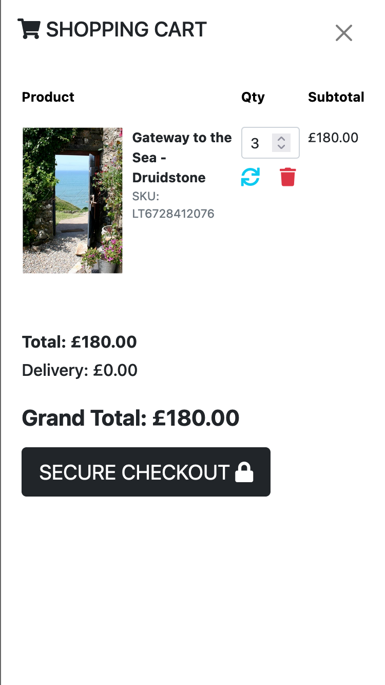

<br>
<br>

# Table of Contents
1. [ABOUT](#about)
2. [LIBRARIES etc](#libraries-frameworks-programs--stuff)
3. [UX](#ux)
    * [User Stories](#user-stories)
    * [Design](#design)
    * [Features](#features)
    * [Testing User Stories](#testing-user-stories-from-user-experience-ux-section)
4. [FUTURE EXPANSION](#future-expansion)
5. [TESTING](#testing)
    * [Bugs](#known-bugs--other-issues)
6. [DEPLOYMENT](#deployment)
7. [DEPENDENCIES](#dependencies)
8. [CODE CREDIT](#code-credits)
<br>
<br>


# ABOUT


An ecommerce website of photographic prints from Pembrokeshire based photographer, Jude Howells: https://jhp-ms4.herokuapp.com/

<br/>
<br/>

# LIBRARIES, FRAMEWORKS, PROGRAMS & STUFF

- Bootstrap 5: Bootstrap was used throughout for layout, buttons etc.
<br/>
- Font Awesome: Font Awesome was used throughout for icons/buttons.
<br/>
- Gitpod: Gitpod was used for all code creation and pushing to GitHub.
<br/>
- GitHub: GitHub was used to store the projects code after being pushed from Gitpod.
<br/>
- Photoshop: Photoshop was used to create all the images.
<br/>
- Balsamiq: Balsamiq was used to create the wireframes during the design process.
<br/>
- Django & Python: For all the logic and CRUD operations.

- Heroku: For deployment of the application

- Crispy Forms for Bootstrap 5: For all the form fun [link](https://pypi.org/project/crispy-bootstrap5/)

- EmailJS: For a simple contact page operation [link](https://www.emailjs.com/)

- Favicon: I always forget these, not today! [link](https://favicon.io/emoji-favicons/bright-button)

- Lorem Ipsum: To demonstrate the blog functionality I used some creative Lorem Ipsum from [here](http://fillerama.io/) 

<br/>
<br/>

# UX

## User Stories

First Time Visitor Goals

>I want to browse or purchase prints.

>I want to navigate the app/site, effortlessly.

>I want to see any new upcoming exhibitions.

<br/>

Returning Visitor Goals

>I want to purchase a print or multiple prints and have them shipped to a previously saved address.

>I want to check the blog & shop to see if there are any new prints.

>I want a quick way to get in contact with the creator.

<br/>

Frequent User Goals

>I want to check the blog/shop/exhibitions to see if there are any new prints or events.

<br/>
<br/>

## Design
## Wireframes
* [Desktop Home Screen](media/readme/01-desktop.png)
* [Desktop Left Menu](media/readme/02-desktop-menu-simple.png)
* [Desktop Shop](media/readme/03-desktop-shop-alt.png)
* [Desktop Cart](media/readme/04-desktop-cart.png)
* [Desktop Profile](media/readme/05-desktop-profile.png)
* [Mobile Home Screen](media/readme/06-mobile.png)
* [Mobile Left Menu](media/readme/07-mobile-menu.png)
* [Mobile Shop](media/readme/08-mobile-shop.png)
* [Mobile Profile](media/readme/09-mobile-profile.png)
* [Mobile Cart](media/readme/10-mobile-cart.png)
* [Mobile Wishlist](media/readme/11-mobile-wishlist)

<br/>
<br/>

## FEATURES 
## Landing page


<br/>
The main product for sale is of epic welsh landscapes so I wanted the user to 'feel' that sense of scale with a fullscreen image. 
<br/>
<br/>

## Top Nav


<br/>
The top nav bar is straight forward and contains a hamburger menu, a profile icon and a shopping cart.
<br/>
<br/>

## Shop


<br/>
The shop nav allows easy scrolling of all the prints at once or the ability to sort by specific categories.
<br/>
<br/>

## Shop 'card'


<br/>
Designed to be stylish and compact but with all the details a customer would need. 
<br/>
<br/>

## Shop 'lightbox'


<br/>
Allows the user a closer look.
<br/>
<br/>

## Messages


<br/>
Placed at the bottom of the screen so as to not interfere with the navigational experience. The messages highlight to the user their recent activity.
<br/>
<br/>

## Notifications


<br/>
A red badge details the number of items in the cart.
<br/>
<br/>

## Right Menu (Shopping Cart)


<br/>
An offcanvas experience. Icons for users to refresh or delete items.
<br/>
<br/>

## Left Menu (Navigation)


<br/>
A simple offcanvas menu/nav. Clicking on 'Jude Howells Photography' will take the user to the landing page.
<br/>
<br/>

## Exhbition


<br/>
The inclusion of Google Maps allows users to plan a trip to the destination.
<br/>
<br/>

## Blog


<br/>
A bootstrap example, altered to include further details and an image.
<br/>
<br/>

## Contact


<br/>
A simple page powered by EmailJS.
<br/>
<br/>

## Profile


<br/>
As you would expect, shipping details and order history.
<br/>
<br/>

## Footer


<br/>
Thrilling!
<br/>
<br/>

## Testing User Stories from User Experience (UX) Section

## First Time Visitor Goals:

>I want to browse or purchase prints.

A (slow loading) shop details the prints and dimensions as well as a lightbox to look closer.

<br/>

>I want to navigate the app/site, effortlessly.

An intuitive interface that works just as well on mobile & desktop.

<br/>

>I want to see any new upcoming exhibitions.

Clearly marked menu navigation, details of date & times and a map to help vistors plan a trip.

<br/>

## Returning Visitor Goals:

>I want to purchase a print or multiple prints and have them shipped to a previously saved address.

The profile app stores the email and postal address.

<br/>

>I want to check the blog & shop to see if there are any new prints.

Perhaps a need for a feature that highlights new products is needed here?  

<br/>

>I want a quick way to get in contact with the creator.

Contact page, email and phone number are all on display.

<br/>

## Frequent User Goals:

>I want to check the blog/shop/exhibitions to see if there are any new prints or events.

Again, either an email newsletter or badges on the site could help indidicate new prints or exhibitions.
<br/>
<br/>

# FUTURE EXPANSION

* Wishlist: Currently the site has a cosmetic 'heart' feature where the icon turns red when clicked, however this has not been fully integrated into the experience. Worse yet, it disappears when the user reloads the page! So future expansion would be to store these favourites in a cookie and allow users to save their wishlist to their profile, with the wishlist having it's on page accessable through the profile dropdown.

* New prints / blogs / exhibitions: The site currently lacks any indication of NEW things. Potential solutions would include badges on the main menu, for example, the left hand navigation when expanded could show a 'new' badge next to the SHOP, EXHIBITION or BLOG menu items. Inside the shop, new prints could be displayed at the top of the page with a new badge also. 

<br/>
<br/>


# TESTING

## Devices & Browsers

The site was tested on the following devices:

Device | OS | Browser
-------|----|---------
iPhone 8 | iOS 14 | Safari, Ghostery, Firefox 
Macbook Pro | Big Sur | Safari, Firefox, Chrome, Brave
iPad | iOS 14 | Safari, Firefox 
<br/>

## Validator testing

HTML: Errors detected on the [W3C validator](https://validator.w3.org/) but in reference to DTL, tripping it up.

PYTHON: A large list of pep8 recommendations came from [Pep8 online](http://pep8online.com). Sadly I haven't given myself enough time to correct all the code for the deadline... :/

CSS: Minor errors were found when passing through the [Jigsaw W3C validator](https://jigsaw.w3.org/css-validator).

<br/>
<br/>

## Lighthouse results

Whilst the 'start' page [scored in the 80s and 90s](media/readme/lh-startpage.png), the shop page, which is the main content of the site, scored around the 70s, illustrating the amount of work that still needs to be done to meet a professional standard. [PDF report](media/readme/LighthouseReport.pdf).

<br/>
<br/>

## Known bugs & other issues

1. S L O W
* The shop page which contains the bulk of the website is very slow. Lighthouse suggests using next-gen image formats however I should integrate either thumbnails and/or some kind of loading display, at the moment, everything has to load all at once, which is a poor user experience.

2. Confirmation emails
* They don't work. New user email confirmation and order confirmation display in the CLI but that's it. Whilst I followed the tutorials closely I have obviously overlooked something in the process and this needs to be fixed.

3. Alluth UI
* It currently doesn't fit with the rest of the sites aesthetic and needs further attention. 

4. WISHLIST
* As mentioned in the FUTURE EXPANSION section above, the hearts are non-functional at the moment.

5. LIGHTBOX
* When the shop automatically loads the 'ALL' category, if you click on a picture then the lightbox is limited to that pictures category. For example if you click a picture from the Land & Sea category, cycling through the pictures will only display Land & Sea prints. 

6. RELOAD / CART
* Any changes to the quantity or deletion of items in the cart will refresh the page to the shop, meaning the user has to click the cart icon again to view it's contents. I did some experiementation with an auto open feature but because the shop is slow to load, by the time it opened the offcanvas, the user might push the cart icon anyway and then automatically dismiss it by accident. This needs further work as it's currently a poor user experience.

<br/>
<br/>

# DEPLOYMENT

## Stripe
Once signed up and logged in > enable Test Mode.<br/>
Developer settings > API Keys > Public and Secret Keys.<br/>
Add STRIPE_PUBLIC_KEY and STRIPE_SECRET_KEY to environment variables<br/>
Dashboard > Webhooks > Add Endpoint<br/>
Endpoint URL: your_domain_goes_here/subscribe/wh/<br/>
Add the webook signing secret as the value for STRIPE_WH_SECRET<br/>

## Stripe test card details:
* Card Number - 4242 4242 4242 4242<br/>
* MM/YY - 4244<br/>
* CVC - 2424<br/>
(i.e. just hammer 4 & 2 until you can’t anymore)<br/>

## Heroku
Once signed up and logged in, click on the dropdown New > Create App.<br/>
Choose an App name > select nearest region > Create App.<br/>
Dashboard > Deployment > Connect to Github > Enter Github credentials > Search for your repo > Connect.<br/>
Click Enable Automatic Deploys once linked up.<br/>

## Postgres Database
Dashboard > Resources > Add-ons search bar type ‘postgres' > select Heroku Postgres.<br/>
Choose 'Hobby Dev - Free' > Submit Order Form.Settings > click Reveal Config Vars > Copy your Database URL<br/>
Connect your PostGres Database URL in settings.py<br/>
(Make sure to delete any existing superuser before the next step otherwise you’ll spend a day dealing with this not working, lots of weird error messages and pure frustration lol)<br/>

Install ```pip3 install dj_database_url``` and ```pip3 install psycopg2-binary``` then ```pip freeze > requirements.txt```<br>
Go to settings.py and add ```import dj_database_url``` and the following code:

    DATABASES = {
        'default': dj_database_url.parse(*your db url here*)
        }

Run ```python3 manage.py migrate``` 

## Gmail Credentials
Once signed up and signed in, navigate to Settings (cog icon).<br/>
Click Security > Signing in to Google > enable 2 Step Verification<br/>
Security dashboard > App passwords > Select App dropdown > Other<br/>
Give your app a name then Select Device > Generate password.<br/>
Add Gmail email address and password as values to EMAIL_HOST_USER and EMAIL_HOST_PASSWORD.<br/>
Add the following to settings.py:

    if 'DEVELOPMENT' in os.environ:
        EMAIL_BACKEND = 'django.core.mail.backends.console.EmailBackend'
        DEFAULT_FROM_EMAIL = 'info@judehowells.co.uk'
    else:
        EMAIL_BACKEND = 'django.core.mail.backends.smtp.EmailBackend'
        EMAIL_USE_TLS = True
        EMAIL_PORT = 587
        EMAIL_HOST = 'smtp.gmail.com'
        EMAIL_HOST_USER = os.environ.get('EMAIL_HOST_USER')
        EMAIL_HOST_PASSWORD = os.environ.get('EMAIL_HOST_PSS')
        DEFAULT_FROM_EMAIL = os.environ.get('EMAIL_HOST_USER')

## Amazon S3 Bucket
To use S3 you need to install a few things: ```pip3 install boto3pip3``` and ```pip3 install django-storages``` then
```pip3 freeze > requirements.txt```. Create ‘custom_storages.py’ in the project root. Under INSTALLED_APPS in settings.py add ```’storages’``` and the following:

    if 'USE_AWS' in os.environ:
        # Cache control
        AWS_S3_OBJECT_PARAMETERS = {
            'Expires': 'Thu, 31 Dec 2099 20:00:00 GMT',
            'CacheControl': 'max-age=94608000',
        }

        # Bucket Config
        AWS_STORAGE_BUCKET_NAME = 'jhp-ms4'
        AWS_S3_REGION_NAME = 'eu-west-2'
        AWS_ACCESS_KEY_ID = os.environ.get('AWS_ACCESS_KEY_ID')
        AWS_SECRET_ACCESS_KEY = os.environ.get('AWS_SECRET_ACCESS_KEY')
        AWS_S3_CUSTOM_DOMAIN = f'{AWS_STORAGE_BUCKET_NAME}.s3.amazonaws.com'

        # Static and media files
        STATICFILES_STORAGE = 'custom_storages.StaticStorage'
        STATICFILES_LOCATION = 'static'
        DEFAULT_FILE_STORAGE = 'custom_storages.MediaStorage'
        MEDIAFILES_LOCATION = 'media'

        # Override static and media URLs in production
        STATIC_URL = f'https://{AWS_S3_CUSTOM_DOMAIN}/{STATICFILES_LOCATION}/'
        MEDIA_URL = f'https://{AWS_S3_CUSTOM_DOMAIN}/{MEDIAFILES_LOCATION}/'

## Production / development
Finally, add this in settings.py:

    SECRET_KEY = os.environ.get(SECRET_KEY, '')
    DEBUG = 'DEVELOPMENT' in os.environ
    ALLOWED_HOSTS = ['jhp-ms4.herokuapp.com', 'localhost']

    if 'DATABASE_URL' in os.environ:
        DATABASES = {
            'default': dj_database_url.parse(os.environ.get('DATABASE_URL'))
        } 
    else:
        DATABASES = {
            'default': {
                'ENGINE': 'django.db.backends.sqlite3',
                'NAME': os.path.join(BASE_DIR, 'db.sqlite3'),
            }
        }

# DEPENDENCIES
Open this project up and type ```pip3 install -r requirements.txt``` :)
<br/>
<br/>

# CODE CREDITS

GENERAL:

* The site owes an obvious debt to the CI Boutique Ado mini-project.

* The Bootstrap website, in particular the [examples page](https://getbootstrap.com/docs/5.0/examples/) helped with many aspects of the layout and design.


SPECIFIC:

* The main 'shop' UI is repurposed from the 'portfolio' section [of this template, 'Magnum Master'](https://usebootstrap.com/theme/magnum-master). Most of the CSS & JS in 'templates/shop/static/' is from this theme. It took some time to figure out what parts where necassary for it to function, I trimmed out as much unnecessary code from the original template as possible.

* The blog section of the site was heavily based on [this tutorial](samuelliedtke.com/blog/implement-comment-system-blog-application-django/).


<br>
<br>
